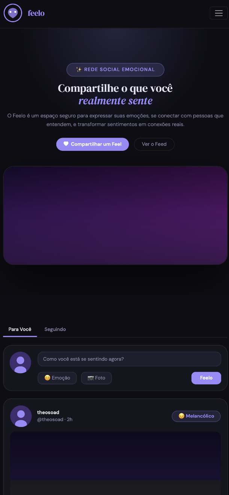
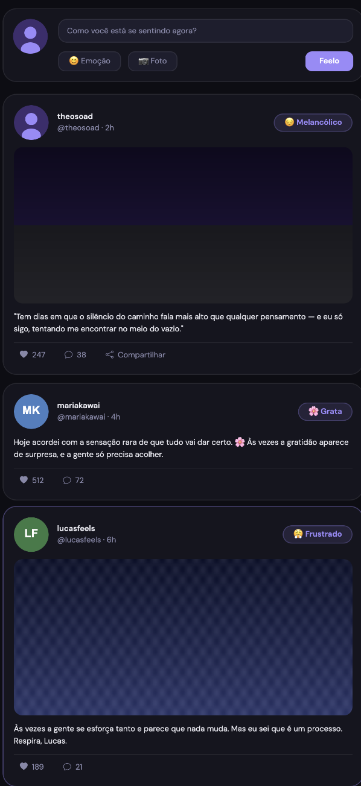

# Feelo — Share What You Feel

Projeto acadêmico desenvolvido para a disciplina de **Desenvolvimento de Interfaces Web (DIW)** do curso de Engenharia de Software na **PUC Minas**.

## Dados do Aluno

* **Nome:** Theo Goulart
* **Curso:** Engenharia de Software
* **Instituição:** PUC Minas
* **Matrícula:** 907916

## Descrição do Projeto

O **Feelo** é uma rede social focada no compartilhamento de emoções e estados de espírito. O objetivo é criar um ambiente seguro onde os usuários possam expressar como estão se sentindo e conectar-se através de empatia.

### Tecnologias Utilizadas

* HTML5 e CSS3
* **Bootstrap 5.3** (Grid System, Components e Responsividade)
* Google Fonts (DM Serif Display e DM Sans)
* Bootstrap Icons

## Responsividade (Bootstrap)

O projeto utiliza o sistema de grid do Bootstrap para garantir que a interface se adapte a diferentes tamanhos de tela.

### Versão Desktop

Na versão desktop, os elementos são distribuídos horizontalmente, aproveitando o espaço da tela para exibir o feed e a sidebar simultaneamente.

### Versão Mobile

Para dispositivos móveis, o Bootstrap aplica o colapso do menu de navegação (navbar-toggler) e o empilhamento vertical dos cards e seções, facilitando a navegação em telas pequenas.

---
© 2026 Feelo - Desenvolvido por Theo Goulart
